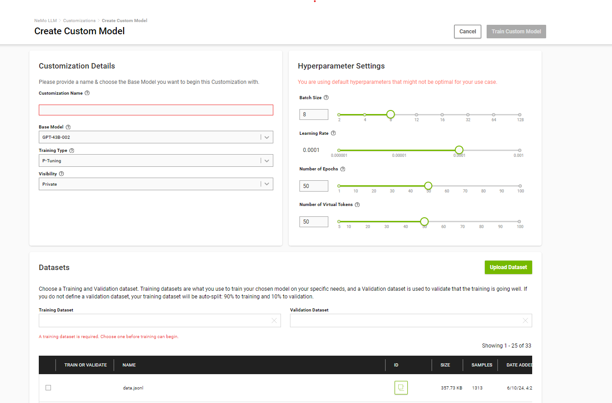
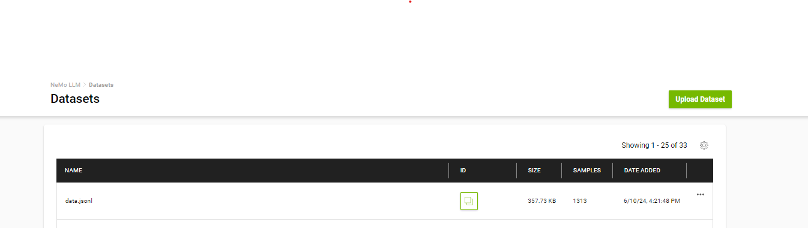
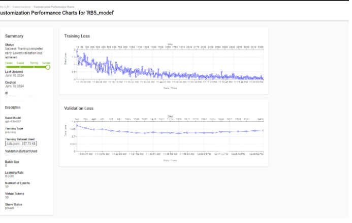
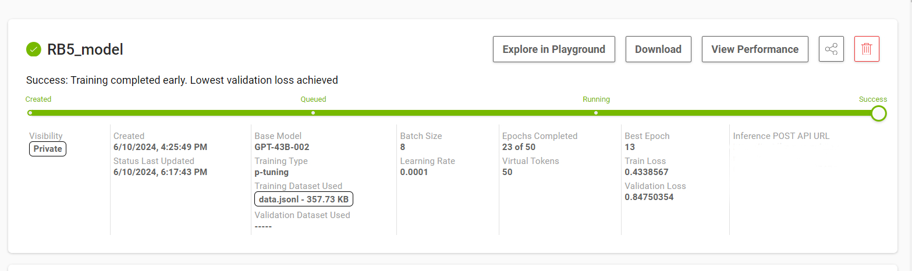

# LLM training and integration on RB5 platform
## Introduction
In the rapidly evolving landscape of artificial intelligence (AI) and machine learning (ML), integrating advanced language models into edge devices is a critical step for enabling smart, real-time applications. One of the most promising combinations in this domain is training large language models (LLMs) using NVIDIA's Nemo cloud service and deploying them on the Qualcomm Robotics RB5 platform. This integration leverages the strengths of both platforms to deliver powerful, efficient, and scalable AI solutions. 

This project exemplifies this integration by developing a voice-interactive system that operates seamlessly on the RB5 platform. The system captures audio input, transcribes it into text, processes the text using an advanced language model, and returns a generated response. By utilizing the computational power of the Nemo cloud for model training and the robust capabilities of the RB5 platform for deployment, the project demonstrates an effective end-to-end solution for real-time, AI-driven interactions.

The project encompasses several key components:

1. **Audio Capture and Processing**:
   - **Audio Recording**: Using PyAudio, the system records audio input from the user. The recording process includes handling silence detection and noise filtering to ensure high-quality audio capture.

   - **Silence Detection**: Implemented to detect and handle pauses in speech, allowing the system to know when to start and stop recording.

2. **Speech-to-Text Conversion**:
   - **Google Cloud Speech-to-Text**: The recorded audio is transcribed into text using Google's Speech-to-Text API. This service provides high accuracy in transcribing spoken language into written text, with support for automatic punctuation and multiple languages.

3. **Language Model Integration**:
   - **Nemo Cloud-based Model**: When enabled, the system utilizes the NemoLLM API to interact with a large-scale language model hosted on the cloud. This model can generate coherent and contextually appropriate responses, benefiting from the vast computational resources available in the cloud.


4. **Response Generation and Playback**:
   - **Text Generation**: The transcribed text is processed by the nemo model to generate a response.


5. **Training and Deployment**:
- The project leverages the powerful "gpt-43b-002" model hosted on NVIDIA's Nemo cloud service.

   **Nemo Cloud Training**:
   - **Model**: The project leverages the powerful "gpt-43b-002" model hosted on NVIDIA's Nemo cloud service.

   - **Dataset**: The model is fine-tuned using a comprehensive dataset that includes diverse queries and responses related to Qualcomm’s technologies, products, and services.

   - **Objective**: This fine-tuning process enhances the model’s ability to generate accurate, contextually relevant, and high-quality responses tailored to Qualcomm's domain.


6. **Web Interface**:
   - **Flask Application**: The system is accessible via a web interface built with Flask. Users can interact with the system through a simple, user-friendly interface that allows them to record audio and receive responses.

## Prerequisites:

### **Hardware Requirements**:

1.  **Qualcomm Robotics RB5 Platform**: This is the main device where the AI model will be deployed and run.
Ensure you have the development kit and all necessary accessories.

2.  **Microphone**: A good quality microphone is needed to capture clear audio input from the user.

### **Software Requirements**:

1. **Operating System** : Compatible with the RB5 platform (a Linux-based system for development on RB5).

- Setup the Network on RB5 using below link https://developer.qualcomm.com/qualcomm-robotics-rb5-kit/quick-start-guide/qualcomm_robotics_rb5_development_kit_bring_up/set-up-network  

2. **Python 3.6+** : The programming language used to develop and run the application.

3. **Python libraries** : To ensure all necessary Python libraries are installed, list them in a `requirements.txt` file and install them using `pip`


### **Environment Setup**:

 Steps to Create a Custom Model on NVIDIA NGC:
  1. **Log In to NGC**: 
      - Visit the NVIDIA NGC website.(https://ngc.nvidia.com/)
      - Log in with your credentials.
    
  2. **Navigate to the NeMo LLM Service** : 
      - From the main dashboard, navigate to NeMo LLM Service.
      - In the sidebar, click on Customizations.
  3. **Create a Custom Model**: 
      - Click on "Create Custom Model".
      - This will open a new setup page to configure your custom model.
  4. **Select Base Model** : 
      - Choose a base model, i.e  GPT-43B-002. This will be the starting point for your customization.
      
#### **Configure Training Settings**:

1. **Training Type** : Choose the appropriate training method, such as p-tuning.

2. **Batch Size** : Set the batch size. For instance, a batch size of 8.

3. **Learning Rate** : Set the learning rate. can set it as 0.0001.

4. **Epochs** : Define the number of epochs for training. In the example, it's set to 50 epochs.

5. **Virtual Tokens** :set the number of virtual tokens.

#### **Upload Your Dataset**

1. **Training Dataset** : Upload your training dataset file, such as data.jsonl. Ensure the dataset is formatted correctly for the model.


2. **Validation Dataset** : Optionally, upload a validation dataset to monitor training performance.

3. **Start Training** : Click Start Training to begin the customization process. You can monitor the progress on the dashboard.


4. On successful training of the model the summary is displayed on the page. 



#### **NemoLLM API Key**:

- Obtain an `API key` and organization ID for accessing the NemoLLM service.

    - **Steps to Generate Nemo API Key**:

      1. **Sign Up / Log In**:

        - Visit the NVIDIA Nemo Cloud Service website(https://ngc.nvidia.com/)
      
        - If you do not have an account, sign up for one. If you already have an account, log in using your credentials.

      2. **Access the NGC Dashboard**:
      -  After logging in, you will be directed to your NGC dashboard.

      3. **Navigate to API Keys** : 
       - On the dashboard, click on your profile icon or name in the top-right corner.
      
      - From the dropdown menu, select "API Key" or "Setup" to access the API key management page.

      4. **Generate a New API Key**:
      - On the API key management page, click on the "Generate API Key" button.
      
      - You may be prompted to name your API key or specify its usage to help you remember its purpose.

      5. **Copy and Store Your API Key** : 
      - Once the API key is generated, it will be displayed on the screen. Copy the key immediately and store it in a secure location.
      
      - Note that for security reasons, this will be the only time the full API key is displayed. If you lose it, you will need to generate a new one.
       

2. **Virtual Environment**:
- Set up a virtual environment for Python to manage dependencies and avoid conflicts.

    ```bash
    python3 -m venv env
    source env/bin/activate
    ```
  - Here `env` is the name of the environment .

3. **Install dependencies** :
  - Run the following command to install all the required Python libraries listed in the requirements.txt file:

    ```bash 
    pip install -r requirements.txt
    ```
    
## Setting Up Google Cloud Service Account
### Set up Google Cloud Speech-to-Text credentials
### Step 1: Set Up Google Cloud Project
1. **Create a Google Cloud Project**:
   - Go to the [Google Cloud Console](https://console.cloud.google.com/).
   - Click on the project drop-down in the top bar.
   - Click "New Project".
   - Enter a project name and select a billing account if prompted.
   - Click "Create".

2. **Select your project**:
   - After the project is created, select it from the project drop-down in the top bar.

### Step 2: Enable APIs
1. **Enable necessary APIs**:
   - Go to the [API Library](https://console.cloud.google.com/apis/library).
   - Search for the APIs you need (e.g., Google Drive API, Google Sheets API, etc.).
   - Click on each API and then click "Enable".

### Step 3: Create Service Account
1. **Navigate to the IAM & Admin section**:
   - Go to the [IAM & Admin section](https://console.cloud.google.com/iam-admin/serviceaccounts) in the Google Cloud Console.
   - Click "Service Accounts" in the left-hand menu.

2. **Create a new service account**:
   - Click "Create Service Account".
   - Enter a service account name, ID, and description.
   - Click "Create and Continue".

3. **Grant the service account permissions**:
   - Select roles that the service account needs. For example, if you need to access Google Cloud Storage, you might grant the "Storage Admin" role.
   - Click "Continue".

4. **Grant users access to the service account**:
   - You can skip this step if you don't need to grant any users access to the service account.
   - Click "Done".

### Step 4: Create and Download Service Account Key
1. **Generate a key for the service account**:
   - In the service accounts list, find the service account you created.
   - Click the "Actions" button (three vertical dots) for that service account.
   - Click "Manage keys".
   - Click "Add Key", then select "Create new key".
   - Choose "JSON" as the key type and click "Create".

2. **Download the key**:
   - The JSON file containing your service account key will be downloaded automatically. This file contains the information needed to authenticate with Google Cloud services.

### Step 5: Use the Service Account Key
1. **Secure your key**:
   - Store this JSON key file securely. Do not share it or check it into source control.

2. **Authenticate with the service account**:
   - Use this key file in your application to authenticate with Google Cloud services.

By following these steps, you will create a new Google Cloud service account and obtain the necessary credentials for accessing Google Cloud services.

In this project this is used in `app.py` python file.
4. **LLM Model Inference on RB5** :

- push the Model to the rb5 through ssh root<ip_rb5> or adb push

  ``` sh
    shell$ scp -r Inferencing root@<ip_rb5>:/home/
  ``` 
-  Run the inference script to query the  model using voice commands. The model will process the input and display the generated text in the user interface.
   
    ``` sh
    sh4$ python3 app.py --nemo 
    ```
  


